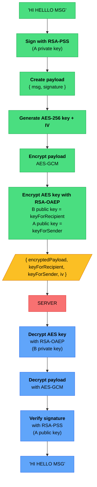

    Yet another CRUD application - that was the university assignment. However, to make it less soul-crushing and actually learn something along the way, I've added real-time chat with hybrid RSA+AES E2E encryption over gRPC streams. Is it overkill for a "find a handyman" app? Absolutely. Will anyone ever send messages sensitive enough to need military-grade encryption? Probably not. But the server genuinely cannot read your conversations, and that's pretty cool. Also, I got to pretend I'm building Signal for a few weeks instead of another TODO LIST with extra steps ;p

  

 https://fuszerkomat.ovh 

  

  
  
  
  
  

  
  
  
  
  

  

  <i>Messages stored in mongo. Private keys encrypted with user password (PBKDF2 + AES-GCM) and stored in SQL for cross-device retrieval. Real-time msgs delivery over gRPC streams</i>

